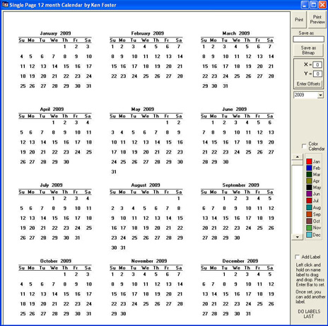



## SinglePage 12 Month Calendar \(Updated\)

### Description

Another fine example of how to make a simple program complicated.Not recommmended for screen resolutions under 1024 X 768.Added:Can now create a Holiday list, change date range and set first day of week to Saturday.
 
### More Info
 

             |
---                |---
**Submitted On**   |2009-02-05 09:16:56
**By**             |[Kenneth Foster](https://github.com/Planet-Source-Code/PSCIndex/blob/master/ByAuthor/kenneth-foster.md)
**Level**          |Intermediate
**User Rating**    |4.7 (33 globes from 7 users)
**Compatibility**  |VB 6\.0
**Category**       |[Complete Applications](https://github.com/Planet-Source-Code/PSCIndex/blob/master/ByCategory/complete-applications__1-27.md)
**World**          |[Visual Basic](https://github.com/Planet-Source-Code/PSCIndex/blob/master/ByWorld/visual-basic.md)
**Archive File**   |[SinglePage214275252009\.zip](https://github.com/Planet-Source-Code/kenneth-foster-singlepage-12-month-calendar-updated__1-71646/archive/master.zip)

